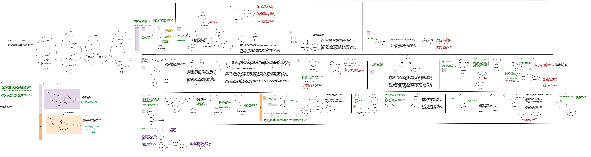

# Bell Labs Transistor Visualization

This project is a computer visualization of the development process behind the transistor, tracking the flow of work across different agents (nodes) and interactions (edges) within the Bell Labs ecosystem and beyond.

## Storyboard



The storyboard outlines the chronological flow of the invention process, showing how institutional structures, people, and interactions evolve across key steps.

## Data Structure

There are three core JSON files: `nodes.json`, `edges.json`, and `steps.json`.

### nodes.json
Each node represents an agent (person or institution):
```json
{
  "node_id": 22,
  "node_name": "Gordon Teal",
  "node_description": "Metallurgist",
  "node_parent_id": 21,
  "node_grandparent_id": 2
}
```

### edges.json
Each edge captures an interaction between agents:
```json
{
  "interaction_id": 0,
  "from_nodes": [2],
  "to_nodes": [3],
  "interaction_description": "...",
  "step_id": 0,
  "bidirectional": 0,
  "unused": 0,
  "violated": 0
}
```

### steps.json
Each step defines a point in the development process:
```json
{
  "step_id": 0,
  "step_description": "...",
  "date": "06.21.1945",
  "phase": "fundamental"
}
```

## Visualization Specifications

The visualization has two parts shown side by side:

On the left side is a 3D directed graph connecting edges and nodes based on the selected step. On the right is a list of steps that the user can select. Only one step can be selected at a time. When a step is selected, the 3D graph zooms into and activates the related edges and nodes, greying out all unrelated elements. When you hover on an edge, it displays the interaction description. When you hover on a node, it shows the node description.

When no steps are selected, all edges and nodes are shown.

### Additional Features

For parent and grandparent IDs:
  - If the interaction is with a parent node (e.g., Bell Labs Administration or Solid-State Research Group), draw a light cloud around all of its children and graph the edge to or from the cloud.
  - If the interaction is with a grandparent node (Bell Labs), draw a light cloud around all of its children and grandchildren, and graph the edge accordingly.
  - External (node_id = 15) is also a notable parent node.

For edges where `violated = 1`: make the edge red and broken.
For edges where `unused = 1`: make the edge slightly greyed out.
